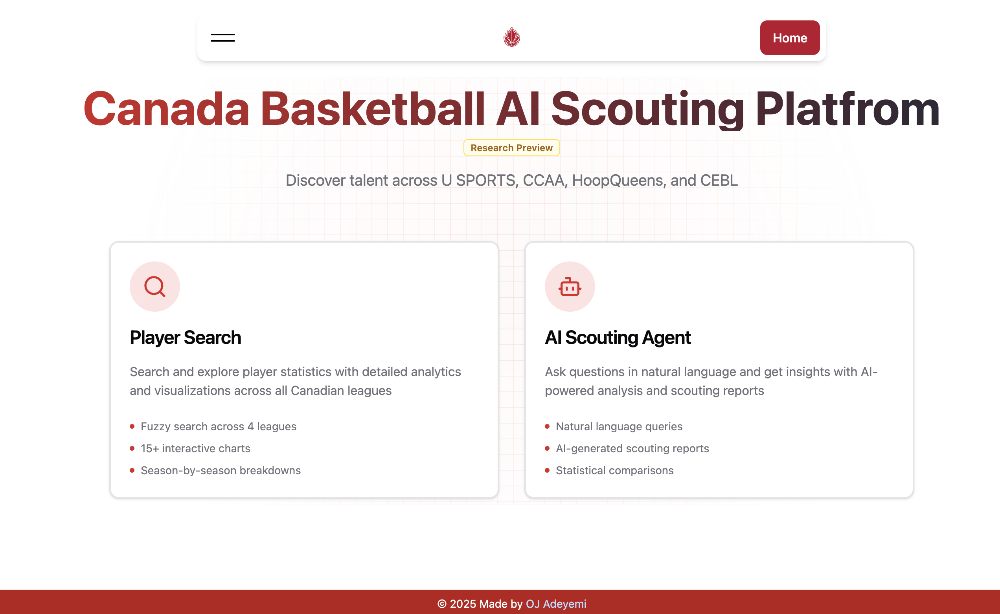

# Canada Basketball ScoutAI Platform



**AI-powered scouting for Canadian basketball.** Ask questions in plain English, get instant insights across 25,000+ players from [U SPORTS](https://en.usports.ca/landing/index), [CCAA](https://www.ccaa.ca/landing/index), [CEBL](https://cebl.ca), and [HoopQueens](https://www.thehoopqueens.com/the-league).

**Powered by [Cohere](https://cohere.com) and [Google Gemini](https://deepmind.google/technologies/gemini/)** – Enterprise-grade AI models optimized for accuracy and speed. Default uses Cohere's Command-A-03-2025, with Gemini 2.5 Flash/Pro recommended for enhanced performance on stats queries and scouting reports.

_Built for the [Canada Basketball](https://www.basketball.ca/) Data Challenge submission._

---

## Overview

Traditional scouting requires hours of manual research. ScoutAI lets you ask **"Who are the top 5 CEBL scorers in 2024 with PER above 20?"** and get answers instantly—complete with charts, stats, and AI-generated scouting reports.

### Key Features

- **Natural Language Queries** – No SQL, no spreadsheets. Just ask.
- **Automated Scouting Reports** – AI-generated PDFs with strengths, weaknesses, and national team fit.
- **25,000+ Players** – Fuzzy search with typo-tolerance across 4 Canadian leagues.
- **Real-Time Insights** – Watch the AI think as it streams responses.
- **Interactive Charts** – Visualize stats instantly (bar, line, scatter plots).

---

## Quick Start

### Prerequisites

- Docker (recommended) **OR** Python 3.13+ and Node.js 18+
- Cohere API key (default) – [Get your free key](https://cohere.com)
- Google Gemini API key (recommended for stats/scouting) – [Get your free key](https://ai.google.dev/)

### Option 1: Docker Compose (Fastest)

```bash
# Clone and configure
git clone https://github.com/ojadeyemi/canada-basketball-scoutai-platform.git
cd canada-basketball-scoutai-platform
cp .env.example .env  # Add your API keys

# Start all services
docker-compose -f docker-compose.local.yml up --build
```

**Access:**

- Frontend: [http://localhost](http://localhost)
- Backend API: [http://localhost:8000/docs](http://localhost:8000/docs)

### Option 2: Local Development

```bash
# Backend (with poetry)
cd backend
poetry install
poetry run python -m playwright install chromium
poetry run uvicorn app.main:app --reload

# Frontend
cd frontend
pnpm install && pnpm dev
```

**Access:**

- Frontend: [http://localhost:5173](http://localhost:5173)
- Backend: [http://localhost:8000](http://localhost:8000)

---

## How It Works

```
User Query → LangGraph AI Agent → Multi-League SQLite DBs → Real-Time Response
```

1. **Ask in plain English** – "Top CEBL scorers with 20+ PER in 2024"
2. **AI Router classifies intent** – Stats query, comparison, scouting report?
3. **SQL Agent queries 4 leagues** – U SPORTS, CCAA, CEBL, HoopQueens (25K+ players)
4. **AI generates insights** – Charts, text summaries, PDF reports
5. **Stream results in real-time** – Watch the AI think via NDJSON streaming

**Tech:** LangGraph (multi-agent orchestration), FastAPI, React, PostgreSQL (session state), SQLite (league data)

---

## Tech Stack

| Layer                | Tech                                                                   |
| -------------------- | ---------------------------------------------------------------------- |
| **AI Orchestration** | LangGraph 1.0 (multi-agent workflows)                                  |
| **Backend**          | FastAPI 0.120, Python 3.13, Playwright (PDF rendering)                 |
| **Frontend**         | React 18, TypeScript 5.9, Vite 5.4, TailwindCSS 3.4                    |
| **Data**             | SQLite (4 league DBs), PostgreSQL (sessions), rapidfuzz (fuzzy search) |
| **LLM Provider**     | Cohere (default: command-a-03-2025), Google Gemini (recommended: 2.5-flash/pro), OpenAI |
| **Deployment**       | Docker, Google Cloud Run, Vercel                                       |

---

## Data Coverage

**4 Canadian Leagues (25,000+ Players)**

- **U SPORTS** – 60+ university programs (2019-2024 seasons)
- **CCAA** – College basketball (OCAA + PacWest conferences)
- **CEBL** – Canadian Elite Basketball League (professional, 2019-2024)
- **HoopQueens** – Women's professional summer league

**Custom Data Engineering:**

- Built a custom CEBL SDK (Python library) for official API access
- Web scrapers with AI-powered HTML parsing for biographical data
- Fuzzy search with rapidfuzz for typo-tolerant queries (e.g., "Xavier Mun" → "Xavier Moon")

---

## Configuration

See [backend/README.md](./backend/README.md) and [frontend/README.md](./frontend/README.md) for environment setup and LLM provider configuration.

---

## Contact

**OJ Adeyemi**

- Email: [ojieadeyemi@gmail.com](mailto:ojieadeyemi@gmail.com)
- LinkedIn: [linkedin.com/in/ojadeyemi](https://www.linkedin.com/in/ojadeyemi/)
- Portfolio: [ojadeyemi](https://ojadeyemi.github.io/)
